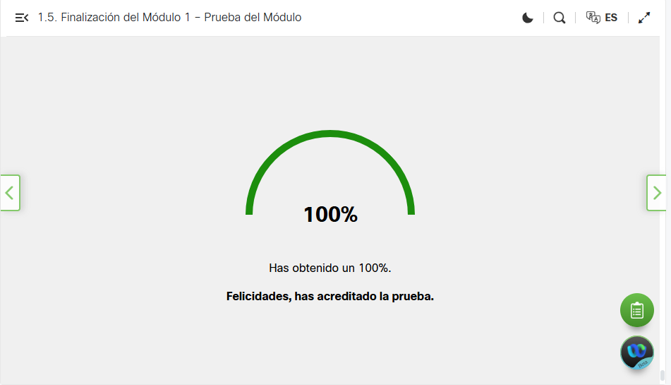
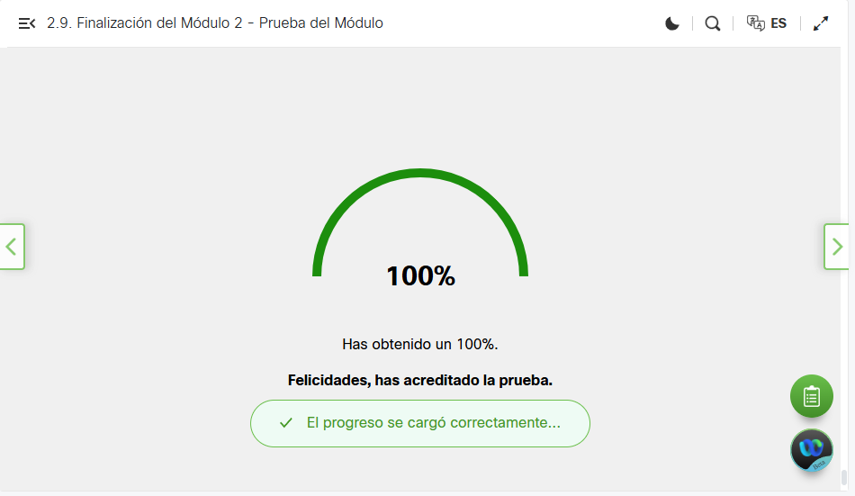
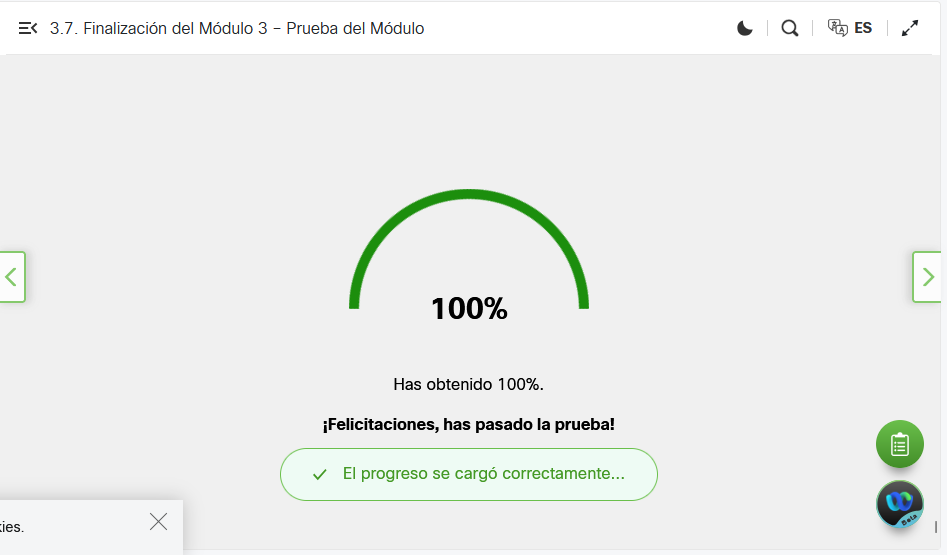
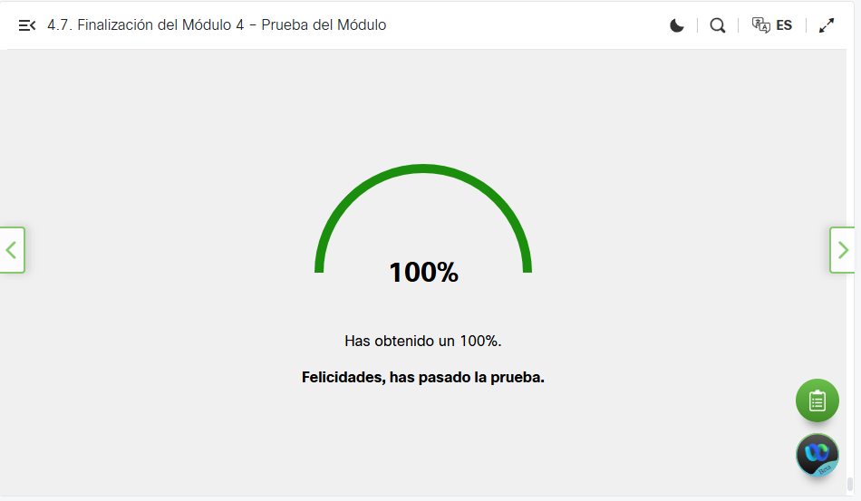
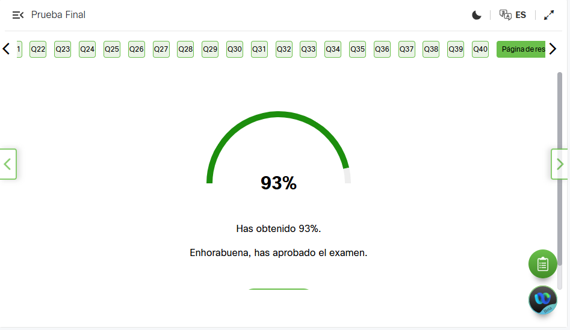
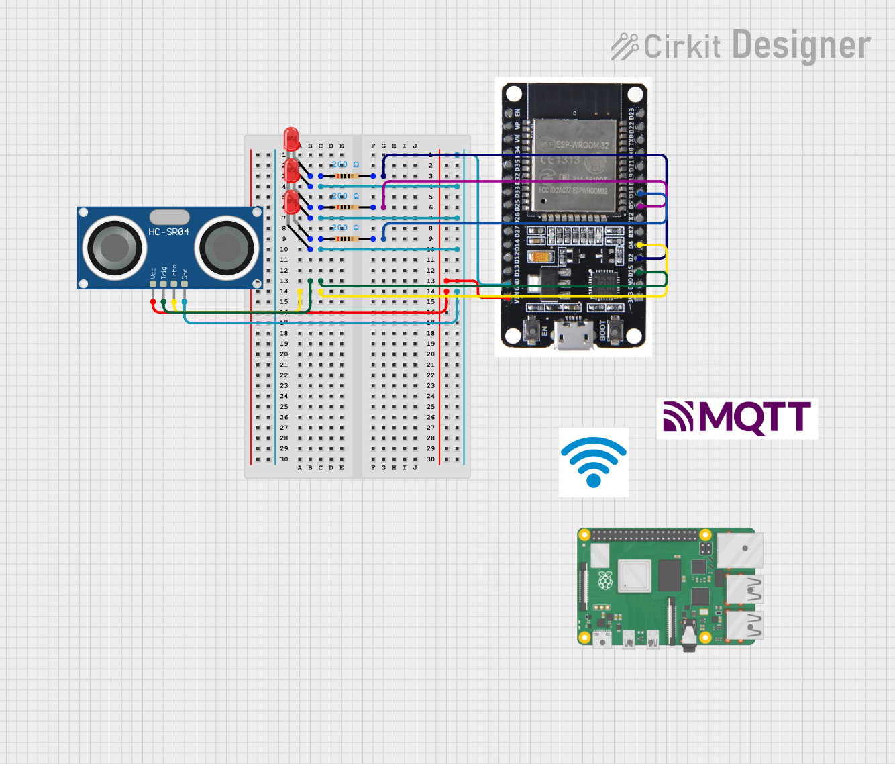

# Unidad1-InstrumentoEvaluacion_IsaacCanoHernandez

# Curso Fundamentos de Python 2
|Modulo|Evidencia|
|--|--|
|**1**||
|**2**||
|**3**||
|**4**||
|**Prueba Final**||

# Parte Practica Ejercicio 1: Almacenamiento de Datos - Ejercicio 2: Control de Actuadores
|Materia|Evidencias|
|--|--|
|**Video Explicacion**|https://drive.google.com/file/d/1xAuxD2WbTN7mWXRuYQJRsl61kOm1UYAd/view?usp=drive_link|
|**Flujo JSON NodeRed**|[`flows.json`](/PartePractica/flows.json)|
|**Codigo Python Thonny**|[`main.py`](/PartePractica/main.py)|
|**Diagrama de circuito**| Ya quedo profe :)|

# Ejercicios en Clase: Videos Demostrativos
| Ejercicio | Video | Explicación |
|--|--|--|
| **CRUD en PostgreSQL:** Realización de operaciones de base de datos desde Node-RED o Python. | https://drive.google.com/file/d/1lL8Wu8g8R-YUJF_xtgYcIN_7QGGixqK9/view?usp=drive_link | Se implementó un CRUD con SQLite, donde, con ayuda de Node-RED, se creó una interfaz sencilla para interactuar con las tablas de la base de datos. |
| **Instalaciones y Configuraciones Básicas:** Configuración inicial de Raspberry Pi, PostgreSQL, Node-RED y Mosquitto. |https://drive.google.com/file/d/1tcZtzw1am7R65crH7EgQYDN_zC5oVqA3/view?usp=drive_link | Se realizó la instalación de tres herramientas fundamentales: PostgreSQL, Node-RED y Mosquitto en una Raspberry Pi, utilizando la terminal de una computadora. |
| **LED y Botón con Raspberry Pi:** Control básico de un LED usando un botón. | https://drive.google.com/file/d/19vM_PMUUrh7k8Ig_VrJpDJhXrBrwYcl2/view?usp=drive_link   https://drive.google.com/file/d/1s5OHZKaumzr5dSh50OkwxMo8NjP-Es2n/view?usp=drive_link   https://drive.google.com/file/d/1xV4TpaPUm2NKT9gzF8tAg5gKmo3FhZNq/view?usp=drive_link   https://drive.google.com/file/d/1Ajd_IdY_kuky-ONkoXAZW9Opdibg48nI/view?usp=drive_link| Se desarrollaron cuatro ejercicios con Python y las librerías GPIO en una Raspberry Pi. En dos de ellos, se encendía y apagaba un LED con cada una de las librerías, y en los otros dos, se encendía el LED con un botón, también con ambas librerías. |
| **Configuración de un sistema de publicación y suscripción con Mosquitto.** | https://drive.google.com/file/d/1m3VzoMrJ2gpeZCDN28Y3PNaCdUV7U0qd/view?usp=drive_link | Se configuró un sistema de publicación y suscripción con Mosquitto en una Raspberry Pi. Se estableció una suscripción a la IP de la Raspberry, permitiendo la publicación de mensajes desde la terminal de la computadora. |

# Ejercicio 4: Figura 2D o 3D soldada
|Significado|Foto|
|--|--|
|**Logotipo JavaScript**| https://drive.google.com/file/d/12J8zVTv0Thb-2ffEnmPJKbcPW3qjp15F/view?usp=drive_link |
